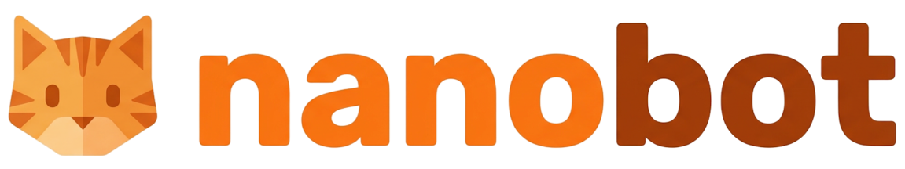

<div align="center">
  
  <h1>necobot</h1>
</div>

A personal fork of [HKUDS/nanobot](https://github.com/HKUDS/nanobot) — an ultra-lightweight personal AI agent.

For the full project description, features, providers, channel guides, and all other documentation, refer to the **[upstream README](https://github.com/HKUDS/nanobot/blob/main/README.md)**.

## What's different from upstream

This fork is functionally identical to upstream, with namespace renames for personal use:

- Package / CLI renamed: `nanobot` → `necobot`
- Config directory: `~/.nanobot/` → `~/.necobot/`

Everything else (features, config format, skills, channels, providers) mirrors upstream.

## Install

Install the fork from source with [uv](https://github.com/astral-sh/uv):

```bash
uv tool install git+https://github.com/mattuylee/necobot.git
```

For alternative install methods (pip, Docker, etc.), see upstream.

## Quick start

```bash
necobot gateway
```

On first run this scaffolds `~/.necobot/` with defaults. See the upstream [Quick Start](https://github.com/HKUDS/nanobot/blob/main/README.md#-quick-start) for provider setup, channel configuration, and more.

## Contributing / issues / deeper usage

This is a personal fork — please direct issues, feature discussions, and contributions to the upstream repo: **https://github.com/HKUDS/nanobot**.

Fork-specific issues (rename glitches, packaging, etc.) can be filed here.

## License

MIT License — see [LICENSE](./LICENSE).
